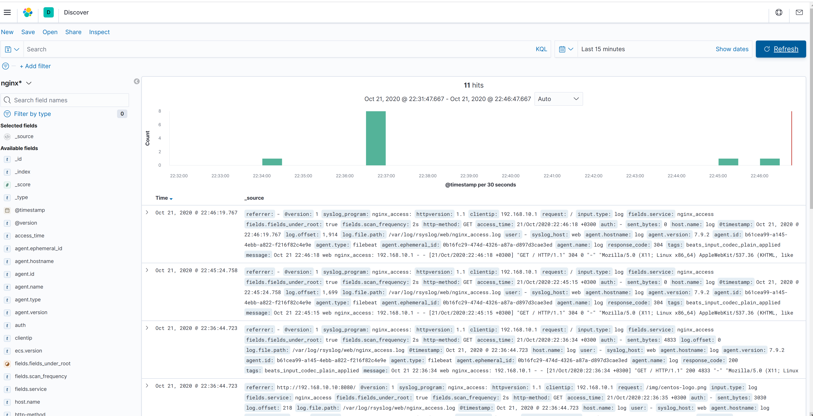

## **Задание**

В вагранте поднимаем 2 машины web и log.
На web поднимаем nginx.
На log настраиваем центральный лог сервер на любой системе на выбор:
- journald
- rsyslog
- elk
Настраиваем аудит следящий за изменением конфигов нжинкса.

Все критичные логи с web должны собираться и локально и удаленно.
Все логи с nginx должны уходить на удаленный сервер (локально только критичные).
Логи аудита должны также уходить на удаленную систему.

* развернуть еще машину elk
И таким образом настроить 2 центральных лог системы elk И какую либо еще.
И elk должны уходить только логи нжинкса, во вторую систему все остальное.


## **Выполнение задания**

**1. Настроить аудит на изменение конфигов нжинкса.**

В ходе выполнения работ, воспользуемся ansible для конфигурации стенда, установки все необходимых утилит и обновления систем.

Добавляем правила (опция -k задает ключ фильтрации, по которому можно будет отследить события при срабатывании данного правила):
Чтобы правила сохранялись в случае перезагрузки, их нужно прописывать в файл `/etc/audit/rules.d/audit.rules`:
```
[root@web ~]# cat /etc/audit/rules.d/audit.rules
## First rule - delete all
-D

## Increase the buffers to survive stress events.
## Make this bigger for busy systems
-b 8192

## Set failure mode to syslog
-f 1

## Audit of nginx configuration files changes
-w /etc/nginx/nginx.conf -p wa -k nginx_conf
-w /etc/nginx/default.d/ -p wa -k nginx_conf
```

После редактирования данного файла нужно рестартануть auditd:
```
[root@web ~]# service auditd restart
Stopping logging:                                          [  OK  ]
Redirecting start to /bin/systemctl start auditd.service
```

Проверяем правила:
```
[root@web ~]# auditctl -l
-w /etc/nginx/nginx.conf -p wa -k nginx_conf
-w /etc/nginx/default.d -p wa -k nginx_conf
```

Изменим порт нжинкса в конфиг-файле и проверим логи auditd:
```
[root@web ~]# ausearch -k nginx_conf
```
<details>
  <summary>Получим следующий вывод:</summary>
```
----
type=CONFIG_CHANGE msg=audit(1593204782.188:887): auid=1000 ses=4 op=updated_rules path="/etc/nginx/nginx.conf" key="nginx_conf" list=4 res=1
----
proctitle=2F7573722F62696E2F707974686F6E002F686F6D652F76616772616E742F2E616E7369626C652F746D702F616E7369626C652D746D702D313539333230343738312E35392D31303234362D3135363534333139373139313336342F416E736962616C6C5A5F636F70792E7079
type=PATH msg=audit(1593204782.188:888): item=4 name="/etc/nginx/nginx.conf" inode=11681 dev=08:01 mode=0100644 ouid=0 ogid=0 rdev=00:00 obj=unconfined_u:object_r:user_home_t:s0 objtype=CREATE cap_fp=0000000000000000 cap_fi=0000000000000000 cap_fe=0 cap_fver=0
type=PATH msg=audit(1593204782.188:888): item=3 name="/etc/nginx/nginx.conf" inode=100669342 dev=08:01 mode=0100644 ouid=0 ogid=0 rdev=00:00 obj=system_u:object_r:httpd_config_t:s0 objtype=DELETE cap_fp=0000000000000000 cap_fi=0000000000000000 cap_fe=0 cap_fver=0
type=PATH msg=audit(1593204782.188:888): item=2 name="/home/vagrant/.ansible/tmp/ansible-tmp-1593204781.59-10246-156543197191364/source" inode=11681 dev=08:01 mode=0100644 ouid=0 ogid=0 rdev=00:00 obj=unconfined_u:object_r:user_home_t:s0 objtype=DELETE cap_fp=0000000000000000 cap_fi=0000000000000000 cap_fe=0 cap_fver=0
type=PATH msg=audit(1593204782.188:888): item=1 name="/etc/nginx/" inode=101417663 dev=08:01 mode=040755 ouid=0 ogid=0 rdev=00:00 obj=system_u:object_r:httpd_config_t:s0 objtype=PARENT cap_fp=0000000000000000 cap_fi=0000000000000000 cap_fe=0 cap_fver=0
type=PATH msg=audit(1593204782.188:888): item=0 name="/home/vagrant/.ansible/tmp/ansible-tmp-1593204781.59-10246-156543197191364/" inode=11566 dev=08:01 mode=040700 ouid=1000 ogid=1000 rdev=00:00 obj=unconfined_u:object_r:user_home_t:s0 objtype=PARENT cap_fp=0000000000000000 cap_fi=0000000000000000 cap_fe=0 cap_fver=0
type=CWD msg=audit(1593204782.188:888):  cwd="/home/vagrant"
type=SYSCALL msg=audit(1593204782.188:888): arch=c000003e syscall=82 success=yes exit=0 a0=27044c0 a1=26560e0 a2=7f505bb9a1c8 a3=0 items=5 ppid=2690 pid=2691 auid=1000 uid=0 gid=0 euid=0 suid=0 fsuid=0 egid=0 sgid=0 fsgid=0 tty=pts1 ses=4 comm="python" exe="/usr/bin/python2.7" subj=unconfined_u:unconfined_r:unconfined_t:s0-s0:c0.c1023 key="nginx_conf"
----
type=PROCTITLE msg=audit(1593204782.188:889): proctitle=2F7573722F62696E2F707974686F6E002F686F6D652F76616772616E742F2E616E7369626C652F746D702F616E7369626C652D746D702D313539333230343738312E35392D31303234362D3135363534333139373139313336342F416E736962616C6C5A5F636F70792E7079
type=PATH msg=audit(1593204782.188:889): item=0 name="/etc/nginx/nginx.conf" inode=11681 dev=08:01 mode=0100644 ouid=0 ogid=0 rdev=00:00 obj=unconfined_u:object_r:user_home_t:s0 objtype=NORMAL cap_fp=0000000000000000 cap_fi=0000000000000000 cap_fe=0 cap_fver=0
type=CWD msg=audit(1593204782.188:889):  cwd="/home/vagrant"
type=SYSCALL msg=audit(1593204782.188:889): arch=c000003e syscall=189 success=yes exit=0 a0=7f50568a16d4 a1=7f505788ef6a a2=26c38c0 a3=24 items=1 ppid=2690 pid=2691 auid=1000 uid=0 gid=0 euid=0 suid=0 fsuid=0 egid=0 sgid=0 fsgid=0 tty=pts1 ses=4 comm="python" exe="/usr/bin/python2.7" subj=unconfined_u:unconfined_r:unconfined_t:s0-s0:c0.c1023 key="nginx_conf"
```

</details>

**2. Отправлять все аудит логи на сервер log.**

Чтобы логи auditd писались на удаленный rsyslog сервер, нужно установить пакет `audispd-plugins` как на клиент web, так и на сервер log. Затем изменить следующие опции в конфиг файлах:

- в файле `/etc/audisp/audisp-remote.conf`:
```
	remote_server = 192.168.10.20
	port = 514
```
- в файле `/etc/audisp/plugins.d/au-remote.conf`:
```
	active = yes
```
- в файле /etc/audit/auditd.conf:
```
	write_logs = no # чтобы логи не писались локально, а только на удаленный сервер
```
На самом сервере log разрешить прием логов в файле `/etc/rsyslog.conf`:
```
	# Provides UDP syslog reception
	$ModLoad imudp
	$UDPServerRun 514

	# Provides TCP syslog reception
	$ModLoad imtcp
	$InputTCPServerRun 514
```

Изменим порт нжинкса в конфиг-файле и проверим логи auditd:
```
[root@log ~]# ausearch -i -k nginx_conf
```

```
[vagrant@log ~]$ sudo ausearch -i -k nginx_conf
----
node=web type=CONFIG_CHANGE msg=audit(10/21/2020 21:51:04.182:1650) : auid=unset ses=unset subj=system_u:system_r:unconfined_service_t:s0 op=add_rule key=nginx_conf list=exit res=yes
----
node=web type=CONFIG_CHANGE msg=audit(10/21/2020 21:51:04.182:1651) : auid=unset ses=unset subj=system_u:system_r:unconfined_service_t:s0 op=add_rule key=nginx_conf list=exit res=yes
----
node=web type=CONFIG_CHANGE msg=audit(10/21/2020 22:34:14.934:2004) : auid=vagrant ses=6 op=updated_rules path=/etc/nginx/nginx.conf key=nginx_conf list=exit res=yes
----
node=web type=PROCTITLE msg=audit(10/21/2020 22:34:14.934:2005) : proctitle=/usr/bin/python /home/vagrant/.ansible/tmp/ansible-tmp-1603308877.1649182-69110-238024790852559/AnsiballZ_copy.py
node=web type=PATH msg=audit(10/21/2020 22:34:14.934:2005) : item=4 name=/etc/nginx/nginx.conf inode=67149903 dev=08:01 mode=file,644 ouid=root ogid=root rdev=00:00 obj=unconfined_u:object_r:user_home_t:s0 objtype=CREATE cap_fp=none cap_fi=none cap_fe=0 cap_fver=0
node=web type=PATH msg=audit(10/21/2020 22:34:14.934:2005) : item=3 name=/etc/nginx/nginx.conf inode=5105717 dev=08:01 mode=file,644 ouid=root ogid=root rdev=00:00 obj=system_u:object_r:httpd_config_t:s0 objtype=DELETE cap_fp=none cap_fi=none cap_fe=0 cap_fver=0
node=web type=PATH msg=audit(10/21/2020 22:34:14.934:2005) : item=2 name=/home/vagrant/.ansible/tmp/ansible-tmp-1603308877.1649182-69110-238024790852559/source inode=67149903 dev=08:01 mode=file,644 ouid=root ogid=root rdev=00:00 obj=unconfined_u:object_r:user_home_t:s0 objtype=DELETE cap_fp=none cap_fi=none cap_fe=0 cap_fver=0
node=web type=PATH msg=audit(10/21/2020 22:34:14.934:2005)
```


**3. Критичные логи оставляем на web и отправляем на log.**

В `/etc/rsyslog.conf` в раздел `#### RULES ####` добавляем следующие строки для отправки всех критических сообщений на сервер log:
```
*.crit action(type="omfwd" target="192.168.10.20" port="514" protocol="tcp"
              action.resumeRetryCount="100"
              queue.type="linkedList" queue.size="10000")
```

**4. Все логи нжинкса отправляем на log, а критичные  оставляем на web.**

В конфиг nginx добавляем следующие строки:
```
error_log /var/log/nginx/error.log crit;
error_log syslog:server=192.168.10.20:514,tag=nginx_error;
...
access_log syslog:server=192.168.10.20:514,tag=nginx_access;

```

На сервере log для разделения логов `nginx_access` и `nginx_error` по отдельным директориям в `/etc/rsyslog.conf` добавляем  следующие правила:
```
if ($hostname == 'web') and ($programname == 'nginx_access') then {
    action(type="omfile" file="/var/log/rsyslog/web/nginx_access.log")
    stop
}

if ($hostname == 'web') and ($programname == 'nginx_error') then {
    action(type="omfile" file="/var/log/rsyslog/web/nginx_error.log")
    stop
}
```

## **ELK**

**1. Все логи нжинкса, пришедшие на log, отправляем на elk.**

Установим Java:
```
[root@elk ~]# yum install -y java-1.8.0-openjdk
```

Добавим репозиторий. Для этого создадим файл `elasticsearch.repo` в директории `/etc/yum.repos.d/` со следующим содержанием:
```
[elasticsearch]
name=Elasticsearch repository for 7.x packages
baseurl=https://artifacts.elastic.co/packages/7.x/yum
gpgcheck=1
gpgkey=https://artifacts.elastic.co/GPG-KEY-elasticsearch
enabled=1
autorefresh=1
type=rpm-md
```

***Установка elasticsearch:***
```
[root@elk ~]# yum -y install elasticsearch
```

Исправим конфиг файл `etc/elasticsearch/elasticsearch.yml`:
```
network.host: 127.0.0.1
```

Настройка выделения памяти для работы базы:
```
[root@elk ~]# cat /etc/elasticsearch/jvm.options
-Xms1g
-Xmx1g
```

Проверка работы базы данных (Базу проверял после провиженинга ансиблом, то есть логи с логстэша уже успели прилететь, сформировав индекс со статусом yellow. Если устанавливать все вручную, в порядке, описанном здесь, то логстэш еще не установлен, и индексов со статусом yellow нет):
```
[vagrant@elk ~]$ curl -XGET localhost:9200/_cat/health?v
epoch      timestamp cluster       status node.total node.data shards pri relo init unassign pending_tasks max_task_wait_time active_shards_percent
1603357048 08:57:28  elasticsearch yellow          1         1      9   9    0    0        2             0                  -                 81.8%

```

Статус `yellow` вызван тем, что в настройках индекса, созданного для логов nginx, установлено количество реплик 1 (по факту у нас нет реплик, хост с elasticsearch  всего один):
```
[root@elk ~]# curl -XGET localhost:9200/_cat/indices?v
health status index                          uuid                   pri rep docs.count docs.deleted store.size pri.store.size
green  open   .kibana-event-log-7.9.2-000001 YyaBBVJrS9CthRQfYAD9Ug   1   0          1            0      5.5kb          5.5kb
yellow open   nginx-2020.10.21               x7WWlPzEQGKn369kJJaIFQ   1   1         11            0     89.6kb         89.6kb
green  open   .apm-custom-link               VgeI9pugSEKO48JZQ6ACEQ   1   0          0            0       208b           208b
green  open   .kibana_task_manager_1         4xVqw6AoQtWv15LjeiF2Aw   1   0          6         2526    304.5kb        304.5kb
green  open   .apm-agent-configuration       _1_viLhvQiWP4sLuHE9KQw   1   0          0            0       208b           208b
green  open   .async-search                  671GyncwRNaxLwbLTMU4JA   1   0          0            0      3.3kb          3.3kb
green  open   .kibana_1                      K365wMdmQIqpwZGz1Dt5Pg   1   0         21            0     10.4mb         10.4mb

```

Чтобы во всех шаблонах, по которым создаются индексы, поменять кол-во реплик на 0, нужно выполнить следующий запрос с указанием параметра `numbers_of_replicas`:
```
curl -XPUT "localhost:9200/_template/all" -H 'Content-Type: application/json' -d'
{
  "template": "*",
  "settings": {
    "number_of_replicas": 0
  }
}'
```

Но так как от logstash'а уже прилетели логи в elasticsearch, индекс создался из дефолтного шаблона с кол-вом реплик 1. Изменим кол-во реплик для индекса `nginx-2020.07.01`:
```
[root@elk ~]# curl -XPUT "localhost:9200/nginx-2020.07.01/_settings" -H 'Content-Type: application/json' -d'
{
  "template": "*",
  "settings": {
    "number_of_replicas": 0
  }
}'
```

Проверим статус индексов:
```
[root@elk ~]# curl -XGET localhost:9200/_cat/indices?v
health status index                          uuid                   pri rep docs.count docs.deleted store.size pri.store.size
green  open   .kibana-event-log-7.9.2-000001 YyaBBVJrS9CthRQfYAD9Ug   1   0          1            0      5.5kb          5.5kb
green  open   nginx-2020.10.21               x7WWlPzEQGKn369kJJaIFQ   1   0         11            0     89.6kb         89.6kb
green  open   .apm-custom-link               VgeI9pugSEKO48JZQ6ACEQ   1   0          0            0       208b           208b
green  open   .kibana_task_manager_1         4xVqw6AoQtWv15LjeiF2Aw   1   0          6         2535    371.3kb        371.3kb
green  open   .apm-agent-configuration       _1_viLhvQiWP4sLuHE9KQw   1   0          0            0       208b           208b
green  open   .async-search                  671GyncwRNaxLwbLTMU4JA   1   0          0            0      3.3kb          3.3kb
green  open   .kibana_1                      K365wMdmQIqpwZGz1Dt5Pg   1   0         21            0     10.4mb         10.4mb
```

И статус базы:
```
[root@elk ~]# curl -XGET localhost:9200/_cat/health?v
epoch      timestamp cluster       status node.total node.data shards pri relo init unassign pending_tasks max_task_wait_time active_shards_percent
1603357401 09:03:21  elasticsearch green          1         1      9   9    0    0        0             0                  -
```

Теперь все green.

***Установка logstash:***
```
[root@elk ~]# yum install -y logstash
```

Конфигурация входных данных logstash `/etc/logstash/conf.d/02-beats-input.conf`:
```
input {
    beats {
        host => "192.168.10.30"
        port => "5044"
    }
}
```

Конфигурация фильтра обработки логов nginx `/etc/logstash/conf.d/10-nginx-filter.conf`:
```
filter {
    if [fields][service] == "nginx_access" {
        grok {
            match => { "message" => "%{SYSLOGTIMESTAMP:syslog_time} %{SYSLOGHOST:syslog_host}+ %{SYSLOGPROG:syslog_program} %{IPORHOST:clientip} %{DATA:user} %{DATA:auth} \[%{HTTPDATE:access_time}\] \"%{WORD:http-method} %{URIPATHPARAM:request} HTTP/%{NUMBER:httpversion}\" %{NUMBER:response_code} %{NUMBER:sent_bytes} \"%{DATA:referrer}\" \"%{DATA:agent}\"" }
        }
    }

    else if [type] == "nginx_error" {
        grok {
            match => { "message" => "%{SYSLOGTIMESTAMP:syslog_time} %{SYSLOGHOST:syslog_host}+ %{SYSLOGPROG:syslog_program} (?<timestamp>%{YEAR}[./-]%{MONTHNUM}[./-]%{MONTHDAY}[- ]%{TIME}) \[%{LOGLEVEL:severity}\] %{POSINT:pid}#%{NUMBER:tid}: %{GREEDYDATA:errormessage}, client: (?<client>%{IP}|%{HOSTNAME}), server: (?<server>%{IP}|%{USERNAME}), request: %{QS:request}, host: %{QS:host}" }
        }
    }

    date {
          match => [ "timestamp" , "dd/MMM/YYYY:HH:mm:ss Z" ]
    }
}
```

Конфигурация выходного потока logstash `/etc/logstash/conf.d/20-output.conf` (отправляем все в индекс nginx, создающийся каждый день заново):
```
output {
    if [fields][service] == "nginx_access" {
        elasticsearch {
            hosts => "localhost:9200"
            index => "nginx-%{+YYYY.MM.dd}"
        }
    }
    if [fields][service] == "nginx_error" {
        elasticsearch {
            hosts => "localhost:9200"
            index => "nginx-%{+YYYY.MM.dd}"
        }
    }
}
```


***Установка filebeat:***

На сервере log добавим репозиторий. Для этого создадим файл `elasticsearch.repo` в директории `/etc/yum.repos.d/` со следующим содержанием:
```
[elasticsearch]
name=Elasticsearch repository for 7.x packages
baseurl=https://artifacts.elastic.co/packages/7.x/yum
gpgcheck=1
gpgkey=https://artifacts.elastic.co/GPG-KEY-elasticsearch
enabled=1
autorefresh=1
type=rpm-md
```

Установим filebeat:
```
[root@log ~]# yum install -y filebeat
```

Конфиг filebeat'a `/etc/filebeat/filebeat.yml` для отправки логов nginx в logstash на сервере elk:
```
filebeat.inputs:
- type: log
  enabled: true
  paths:
    - /var/log/rsyslog/web/nginx_access.log
  fields:
    service: nginx_access
    fields_under_root: true
    scan_frequency: 2s

- type: log
  enabled: true
  paths:
    - /var/log/rsyslog/web/nginx_error.log
  fields:
    service: nginx_error
    fields_under_root: true
    scan_frequency: 2s

output.logstash:
  hosts: ["192.168.10.30:5044"]
```

***Установка kibana:***
```
[root@elk ~]# yum install -y kibana
```

Визуализация логов:




## **Проверка ДЗ**

1. Выполнить `vagrant up`.
2. В `./web/vars/main.yml` изменить порт nginx, выполнить `ansible-playbook logging.yml`. Проверить, что логиги аудита с сервера web (192.168.10.10) попали на сервер log (192.168.10.20) - для этого выполнить `ausearch -i -k nginx_conf`
3. Для проверки визуализации в Kibana выполнить несколько запросов к http://192.168.10.10 (это дефолтная и единственная страница на сервере). Затем зайти в Kibana на http://192.168.10.30:5601/ и добавить индекс nginx-* для просмотра логов nginx с сервера web.
